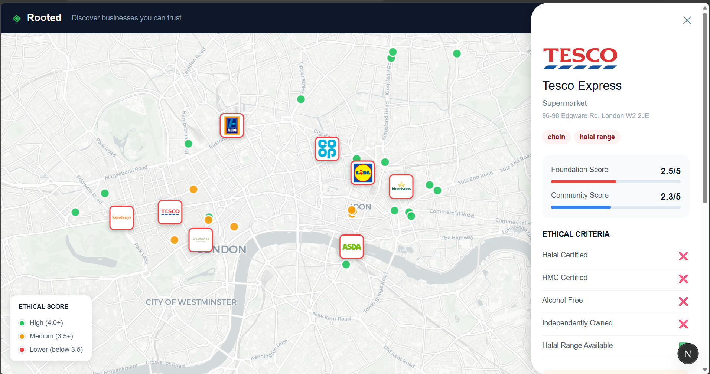

# Rooted 🌱

**Discover businesses you can trust.**

Rooted is a map-based ethical business discovery platform built for consumers who want to shop with their conscience. Find halal-certified restaurants, independent local shops, and see exactly how major supermarkets score on ethical criteria, including unethical countries and settlement links, alcohol, and corporate ownership.

---

## The Problem

When you go shopping, do you know if your money is funding something you disagree with? Finding ethical local businesses - halal certified, independent, not linked to unethical regimes - is harder than it should be. There's no single place to discover them.

Rooted fixes that.

---

## What It Does

- 🗺️ **Map-based discovery** - every business shown as a colour-coded pin by ethical score
- 🟢 Green = High ethical score (4.0+)
- 🟡 Amber = Medium (3.5+)
- 🔴 Red = Lower (below 3.5)
- 🏪 **Supermarket logos** on the map — instantly see where the big chains are vs independents
- 📋 **Side panel** with full ethical breakdown per business:
  - Halal Certified
  - HMC Certified
  - Alcohol Free
  - Independently Owned
  - Halal Range Available
  - Unethical countries & Settlements links
- ⭐ **Community scoring** - users can rate businesses and update the community score in real time
- ⚠️ **Concerns flagging** - ethical concerns surfaced clearly per business

---

## The Scoring Framework

Each business is scored out of 5 across four equally weighted criteria:

| Criteria                   | Weight |
| -------------------------- | ------ |
| Halal Certified            | 1.25   |
| Alcohol Free               | 1.25   |
| Independently Owned        | 1.25   |
| No Harmful Corporate Links | 1.25   |

Community scores layer on top, weighted so a single rating cannot significantly move the score.

---

## How It's Different

| Product          | What it does                                            |
| ---------------- | ------------------------------------------------------- |
| Boycat           | Scans products in a supermarket                         |
| Ethical Consumer | Rates brands online, no map                             |
| Good On You      | Fashion brands only                                     |
| **Rooted**       | **Map-based local discovery across all business types** |

> "Boycat tells you what not to buy. Rooted tells you where to go instead."

---

## Tech Stack

- **Next.js** (App Router) + TypeScript
- **Tailwind CSS**
- **Leaflet.js** + OpenStreetMap / CARTO tiles
- **Overpass API** (OpenStreetMap data, with hardcoded fallback)
- Business data: manually verified with real ethical criteria

---

## Data Sources

- Business locations: OpenStreetMap via Overpass API
- Ethical criteria: manually researched per business
- Halal certification: HMC and community knowledge
- Unethical countries/settlement links: BDS movement research, public boycott lists

---

## Built At

**Shared Futures Buildathon** - 7 June 2026, Central London  
24-hour solo build. Track C3: Ethical Local Discovery.

---

## Why I Built This

I want to shop with my conscience. Knowing whether my money is funding unethical regimes, supporting local independent businesses, or going to halal-certified places matters to me. Rooted is the tool I wished existed.
